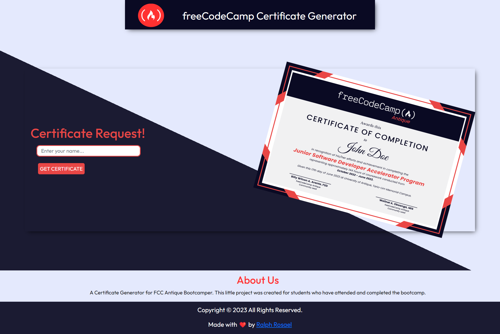

# Certificate Generator

A Certificate Generator for FCC Antique Bootcamper. This little project was created for students who have attended and completed the bootcamp. The certificate is generated using HTML, CSS, and JavaScript. The certificate is generated in real-time and can be downloaded as a PDF file.

### Screenshot

